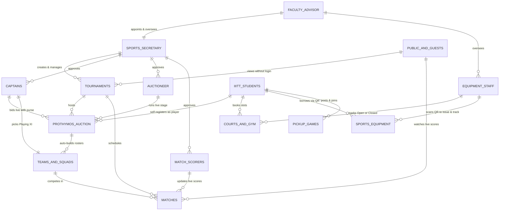

# Sports

Summary diagram

```mermaid
erDiagram
    FACULTY_ADVISOR ||--|| SPORTS_SECRETARY : "appoints & oversees"
    FACULTY_ADVISOR ||--o{ EQUIPMENT_STAFF : "oversees"

    SPORTS_SECRETARY ||--o{ TOURNAMENTS : "creates & manages"
    SPORTS_SECRETARY ||--o{ CAPTAINS : "approves"
    SPORTS_SECRETARY ||--o{ AUCTIONEER : "approves"
    SPORTS_SECRETARY ||--o{ MATCH_SCORERS : "approves"

    IIITT_STUDENTS ||--o{ PROTHYMOS_AUCTION : "self-registers as player"
    IIITT_STUDENTS ||--o{ COURTS_AND_GYM : "books slots"
    IIITT_STUDENTS ||--o{ SPORTS_EQUIPMENT : "borrows via QR"
    IIITT_STUDENTS ||--o{ PICKUP_GAMES : "posts & joins"

    EQUIPMENT_STAFF ||--o{ COURTS_AND_GYM : "marks Open or Closed"
    EQUIPMENT_STAFF ||--o{ SPORTS_EQUIPMENT : "scans QR to issue & track"

    TOURNAMENTS ||--o{ PROTHYMOS_AUCTION : "hosts"
    AUCTIONEER ||--o{ PROTHYMOS_AUCTION : "runs live stage"
    CAPTAINS ||--o{ PROTHYMOS_AUCTION : "bids live with purse"
    PROTHYMOS_AUCTION ||--o{ TEAMS_AND_SQUADS : "auto-builds rosters"

    CAPTAINS ||--|| TEAMS_AND_SQUADS : "picks Playing XI"
    TEAMS_AND_SQUADS ||--o{ MATCHES : "competes in"
    TOURNAMENTS ||--o{ MATCHES : "schedules"
    MATCH_SCORERS ||--o{ MATCHES : "updates live scores"

    PUBLIC_AND_GUESTS ||--o{ TOURNAMENTS : "views without login"
    PUBLIC_AND_GUESTS ||--o{ MATCHES : "watches live scores"
```

```mermaid
erDiagram
    %% ==========================================
    %% 1. USERS & ROLE-BASED ACCESS CONTROL (RBAC)
    %% ==========================================
    USERS {
        uuid user_id PK
        string email UK "iiitt.ac.in or staff/faculty email"
        string full_name
        string roll_number "nullable for staff/faculty"
        enum account_type "STUDENT, STAFF, FACULTY"
        enum base_role "STUDENT, SPORTS_SEC, EQUIP_STAFF, FACULTY_ADVISOR"
        string qr_code_hash UK "For equipment borrowing"
        boolean is_active
        timestamp created_at
    }

    ROLE_ASSIGNMENTS {
        uuid assignment_id PK
        uuid user_id FK
        uuid tournament_id FK "nullable for non-event roles"
        enum event_role "CAPTAIN, AUCTIONEER, MATCH_SCORER"
        uuid granted_by FK "Sports Sec or Faculty Advisor"
        timestamp granted_at
    }

    %% ==========================================
    %% 2. SPORTS, TOURNAMENTS & FRANCHISES
    %% ==========================================
    SPORTS {
        uuid sport_id PK
        string name "Cricket, Football, Badminton, etc."
        enum category "TEAM, SOLO"
        int max_squad_size
        string scoring_format
    }

    TOURNAMENTS {
        uuid tournament_id PK
        string name "e.g., Prothymos 2026"
        enum type "PROTHYMOS, INTRA_IIITT, INTER_IIIT"
        date start_date
        date end_date
        boolean is_public "True = Guest/Public readable"
        uuid created_by FK
    }

    TEAMS {
        uuid team_id PK
        uuid tournament_id FK
        uuid sport_id FK
        string name
        string logo_url
        uuid captain_id FK
        int total_purse "Auction budget"
        int remaining_purse
        boolean is_franchise
    }

    %% ==========================================
    %% 3. PROTHYMOS AUCTION ENGINE
    %% ==========================================
    AUCTIONS {
        uuid auction_id PK
        uuid tournament_id FK
        uuid sport_id FK
        uuid auctioneer_id FK
        enum status "UPCOMING, LIVE, PAUSED, COMPLETED"
        int base_increment
    }

    AUCTION_PLAYERS {
        uuid pool_id PK
        uuid auction_id FK
        uuid user_id FK "Self-registered student"
        string playing_role "All-rounder, Striker, etc."
        enum tier "MARQUEE, TIER_1, TIER_2, UNCAPPED"
        int base_price
        enum status "AVAILABLE, ON_BLOCK, SOLD, UNSOLD"
        uuid sold_to_team_id FK "nullable"
        int sold_price "nullable"
    }

    BIDS {
        uuid bid_id PK
        uuid auction_id FK
        uuid pool_id FK
        uuid team_id FK
        uuid bidder_id FK "Captain / Franchise Owner"
        int amount
        timestamp bid_timestamp
        boolean is_valid
    }

    %% ==========================================
    %% 4. MATCHES, LINEUPS & LIVE SCORING
    %% ==========================================
    MATCHES {
        uuid match_id PK
        uuid tournament_id FK
        uuid sport_id FK
        uuid team_a_id FK
        uuid team_b_id FK
        uuid scorer_id FK
        uuid facility_id FK
        timestamp scheduled_time
        enum status "UPCOMING, LIVE, COMPLETED"
        uuid winner_team_id FK "nullable"
        json score_summary
    }

    MATCH_LINEUPS {
        uuid lineup_id PK
        uuid match_id FK
        uuid team_id FK
        uuid user_id FK
        boolean is_playing_xi
    }

    SCORE_EVENTS {
        uuid event_id PK
        uuid match_id FK
        uuid logged_by FK "Match Scorer"
        string event_type "RUN, WICKET, GOAL, POINT, FOUL"
        json payload
        timestamp created_at
    }

    %% ==========================================
    %% 5. CAMPUS OPERATIONS (COURTS, GEAR, PICKUP)
    %% ==========================================
    FACILITIES {
        uuid facility_id PK
        string name "Badminton Court 1, Cricket Ground, etc."
        uuid sport_id FK
        enum status "OPEN, OCCUPIED, MAINTENANCE, RAIN_CLOSED"
        uuid updated_by FK "Equipment/Ground Staff"
    }

    SLOT_BOOKINGS {
        uuid booking_id PK
        uuid facility_id FK
        uuid user_id FK
        timestamp start_time
        timestamp end_time
        enum status "CONFIRMED, CANCELLED"
    }

    EQUIPMENT_ITEMS {
        uuid item_id PK
        uuid sport_id FK
        string name
        int total_qty
        int available_qty
        enum condition_status "GOOD, LOW_STOCK, DAMAGED"
    }

    EQUIPMENT_LOGS {
        uuid log_id PK
        uuid item_id FK
        uuid borrower_id FK "Student"
        uuid issued_by_staff_id FK "Equipment Staff"
        timestamp issued_at
        timestamp due_at
        timestamp returned_at "nullable"
        enum status "ISSUED, RETURNED, OVERDUE, DAMAGED"
    }

    MATCHMAKING_POSTS {
        uuid post_id PK
        uuid creator_id FK
        uuid sport_id FK
        uuid facility_id FK
        int players_needed
        timestamp scheduled_time
        enum status "OPEN, FULL, CLOSED"
    }

    %% ==========================================
    %% RELATIONSHIPS
    %% ==========================================
    USERS ||--o{ ROLE_ASSIGNMENTS : "holds"
    USERS ||--o{ ROLE_ASSIGNMENTS : "grants"
    TOURNAMENTS ||--o{ ROLE_ASSIGNMENTS : "scopes"

    USERS ||--o{ TOURNAMENTS : "creates"
    TOURNAMENTS ||--o{ TEAMS : "has"
    SPORTS ||--o{ TEAMS : "categorizes"
    USERS ||--o{ TEAMS : "captains"

    TOURNAMENTS ||--o{ AUCTIONS : "hosts"
    SPORTS ||--o{ AUCTIONS : "for"
    USERS ||--o{ AUCTIONS : "runs as auctioneer"
    AUCTIONS ||--o{ AUCTION_PLAYERS : "lists"
    USERS ||--o{ AUCTION_PLAYERS : "self-registers"
    TEAMS ||--o{ AUCTION_PLAYERS : "buys"
    AUCTIONS ||--o{ BIDS : "records"
    AUCTION_PLAYERS ||--o{ BIDS : "receives"
    TEAMS ||--o{ BIDS : "places"
    USERS ||--o{ BIDS : "submits"

    TOURNAMENTS ||--o{ MATCHES : "schedules"
    SPORTS ||--o{ MATCHES : "played in"
    TEAMS ||--o{ MATCHES : "competes as A/B"
    USERS ||--o{ MATCHES : "scores"
    FACILITIES ||--o{ MATCHES : "hosts"
    MATCHES ||--o{ MATCH_LINEUPS : "has"
    TEAMS ||--o{ MATCH_LINEUPS : "submits"
    USERS ||--o{ MATCH_LINEUPS : "plays in"
    MATCHES ||--o{ SCORE_EVENTS : "logs"
    USERS ||--o{ SCORE_EVENTS : "records"

    SPORTS ||--o{ FACILITIES : "played at"
    USERS ||--o{ FACILITIES : "updates status"
    FACILITIES ||--o{ SLOT_BOOKINGS : "booked via"
    USERS ||--o{ SLOT_BOOKINGS : "books"

    SPORTS ||--o{ EQUIPMENT_ITEMS : "uses"
    EQUIPMENT_ITEMS ||--o{ EQUIPMENT_LOGS : "tracked by"
    USERS ||--o{ EQUIPMENT_LOGS : "borrows"
    USERS ||--o{ EQUIPMENT_LOGS : "issues as staff"

    USERS ||--o{ MATCHMAKING_POSTS : "posts"
    SPORTS ||--o{ MATCHMAKING_POSTS : "for"
    FACILITIES ||--o{ MATCHMAKING_POSTS : "at"
```
